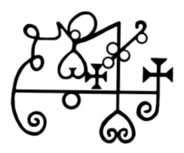

# sigill
Sigill prevents unauthorized SQL. Sigill only understand SQL.



## Examples

Imagine you've created a dashboard in [Apache Superset](https://superset.apache.org/) with a chart showing how many people with a given last name and within a given age range exist in each country. The query behind the chart might look like this:

```sql
SELECT
    country, last_name, age_bucket, COUNT(*)
FROM
    dim_users
WHERE
    last_name = 'Lee'
GROUP BY
    country, last_name, age_bucket;
```

You share the dashboard with a co-worker who doesn't haven't access to the underlying table. The co-worker is not interested in age buckets, so they modify the query to:

```sql
SELECT
    country, last_name, COUNT(*)
FROM
    dim_users
WHERE
    last_name = 'Lee'
GROUP BY
    country, last_name;
```

This should be fine to run, since the second query is a subset of the first query. However, the co-worker shouldn't be able to look at data for a different last name:

```sql
SELECT
    country, last_name, COUNT(*)
FROM
    dim_users
WHERE
    last_name = 'Smith'
GROUP BY
    country, last_name;
```

Even some simpler queries shouldn't be allowed:

```sql
SELECT COUNT(*) FROM dim_users;
```

While this one should be allowed:

```sql
SELECT COUNT(*) FROM dim_users WHERE last_name = 'Lee';
```

**Sigill** is a library that checks if a given query is a subquery of a set of allowed queries. It does this by parsing the queries into an abstract syntax tree (AST) and comparing the ASTs in a semantic way.

Additionally, it can be configured to modify queries so that they match the allowed queries. For example, if a user is allowed to run this query:

```sql
SELECT
    ANONYMIZE(last_name), age, preferred_color
FROM
    users;
```

Then a query like this one:

```sql
SELECT last_name, age FROM users WHERE age = MAX(age);
```

Would be converted to:

```sql
SELECT ANONYMIZE(last_name), age FROM users WHERE age = MAX(age);
```

## Supported SQL Features

Sigill supports a comprehensive range of SQL features and complex query constructs:

### Basic SQL Operations
- **SELECT** statements with column projections
- **WHERE** clauses with conditions
- **GROUP BY** and **HAVING** clauses
- **ORDER BY** clauses
- **Aggregate functions** (COUNT, SUM, AVG, MIN, MAX)

### Joins
All types of JOIN operations are supported:

```sql
-- Inner JOIN
SELECT u.name, o.total
FROM users u
INNER JOIN orders o ON u.id = o.user_id

-- Left/Right/Full OUTER JOINs
SELECT u.name, o.total
FROM users u
LEFT JOIN orders o ON u.id = o.user_id

-- Self JOINs
SELECT u1.name, u2.name as manager_name
FROM users u1
INNER JOIN users u2 ON u1.manager_id = u2.id
```

### UNION, INTERSECT, EXCEPT
Compound statements are fully supported:

```sql
-- UNION operations
SELECT name FROM users
UNION
SELECT name FROM customers

-- INTERSECT and EXCEPT
SELECT name FROM users
INTERSECT
SELECT name FROM active_users
```

### Common Table Expressions (CTEs)
Both simple and recursive CTEs:

```sql
-- Simple CTE
WITH user_summary AS (
    SELECT name, age FROM users WHERE age > 18
)
SELECT name FROM user_summary

-- Recursive CTE
WITH RECURSIVE employee_hierarchy AS (
    SELECT id, name, manager_id FROM employees WHERE manager_id IS NULL
    UNION ALL
    SELECT e.id, e.name, e.manager_id
    FROM employees e
    INNER JOIN employee_hierarchy eh ON e.manager_id = eh.id
)
SELECT name FROM employee_hierarchy
```

### Subqueries
Subqueries are supported in all contexts:

```sql
-- WHERE clause subqueries
SELECT name FROM users
WHERE id IN (SELECT user_id FROM orders WHERE total > 100)

-- SELECT clause subqueries
SELECT name,
       (SELECT COUNT(*) FROM orders WHERE user_id = users.id) as order_count
FROM users

-- FROM clause subqueries
SELECT name FROM (
    SELECT name, age FROM users WHERE age > 18
) as filtered_users
```

### Window Functions
Full support for analytical functions:

```sql
SELECT
    name,
    ROW_NUMBER() OVER (PARTITION BY department ORDER BY salary DESC) as rank,
    LAG(salary, 1) OVER (ORDER BY hire_date) as prev_salary
FROM users
```

### Advanced Features
- **ANONYMIZE functions** for data privacy
- **Wildcard table permissions** (`SELECT * FROM "*"`)
- **Complex expressions** and mathematical operations
- **Nested queries** with multiple levels of complexity

## API Reference

### Core Functions

```python
from sigill import check, check_permission, tighten

# Check if a query is allowed by any permission in a set
allowed = check(
    sql="SELECT name FROM users WHERE age > 18",
    permissions={
        "SELECT name, age FROM users",
        "SELECT * FROM users WHERE department = 'engineering'"
    }
)

# Check if a query is allowed by a specific permission
allowed = check_permission(
    sql="SELECT name FROM users WHERE age > 21",
    permission="SELECT name, age FROM users WHERE age > 18"
)

# Modify a query to conform to the best matching permission
tightened_query = tighten(
    sql="SELECT name, age FROM users WHERE age > 18",
    permissions={"SELECT ANONYMIZE(name), age FROM users WHERE age > 21"}
)
# Result: SELECT ANONYMIZE(name), age FROM users WHERE age > 21
```

### Permission Logic

Sigill uses semantic SQL comparison to determine if a query is a "subset" of a permission:

- **Tables**: Query tables must be present in permission tables (supports wildcards)
- **Columns**: Query columns must be available in permission (fewer columns allowed)
- **WHERE clauses**: Query conditions must be more restrictive than permission
- **GROUP BY**: Query can group by fewer columns than permission
- **Aggregations**: Allowed when query has same or more aggregation

### Examples

#### Basic Permission Checking
```python
# ✅ Allowed - fewer columns
check_permission(
    sql="SELECT name FROM users",
    permission="SELECT name, email FROM users"
)

# ✅ Allowed - more restrictive WHERE clause
check_permission(
    sql="SELECT name FROM users WHERE age > 21",
    permission="SELECT name FROM users WHERE age > 18"
)

# ❌ Not allowed - different WHERE condition
check_permission(
    sql="SELECT name FROM users WHERE department = 'sales'",
    permission="SELECT name FROM users WHERE department = 'engineering'"
)
```

#### Complex Query Support
```python
# ✅ Allowed - UNION query with wildcard permission
check_permission(
    sql="""
        SELECT name FROM users
        UNION
        SELECT name FROM customers
    """,
    permission='SELECT name FROM "*"'
)

# ✅ Allowed - CTE with proper table access
check_permission(
    sql="""
        WITH active_users AS (
            SELECT name, status FROM users WHERE active = 1
        )
        SELECT name FROM active_users
    """,
    permission="SELECT name, status, active FROM users"
)

# ✅ Allowed - Window function with column permissions
check_permission(
    sql="""
        SELECT name,
               ROW_NUMBER() OVER (ORDER BY salary) as rank
        FROM users
    """,
    permission="SELECT name, salary FROM users"
)
```

#### Wildcard Permissions
```python
# Match any table
permission = 'SELECT name FROM "*"'

# Match any table in a schema
permission = 'SELECT name FROM "schema.*"'

# Match any schema in a catalog
permission = 'SELECT name FROM "catalog.*.*"'
```

## Installation

```bash
# Using uv (recommended)
uv add sigill

# Using pip
pip install sigill
```

## Development

```bash
# Clone the repository
git clone <repository-url>
cd sigill

# Install dependencies
uv install

# Run tests
uv run pytest

# Run tests with coverage
uv run pytest --cov=src/sigill

# Run linting
uv run ruff check
uv run black src/ tests/
uv run mypy src/
```

## Test Coverage

Sigill maintains **100% code coverage** with comprehensive testing:
- **164 comprehensive tests** covering all major functionality
- **Complete line coverage**: Every single line of code is tested
- **Complex SQL scenarios**: UNION, CTEs, JOINs, subqueries, window functions
- **Edge case handling**: Error conditions, malformed queries, permission validation
- **Production ready**: Extensively tested for maximum reliability

## License

[Add your license information here]

## Contributing

[Add contributing guidelines here]
